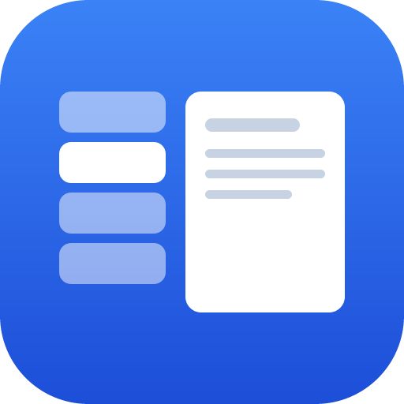
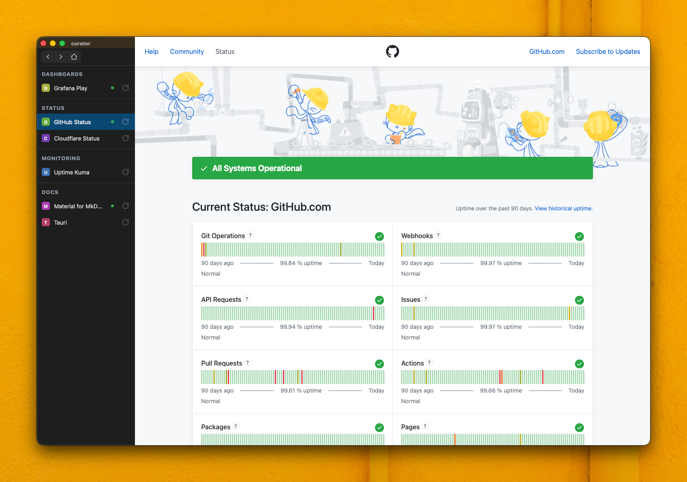

<p align="center">
  
</p>

<h1 align="center">curator</h1>

<p align="center">
  <a href="https://github.com/Lockyc/curator/releases/latest"></a>
  
  
  <a href="LICENSE"></a>
</p>

A dedicated, always-findable home for the browser tabs you can't afford to lose. macOS only.

<p align="center"></p>

Not a general browser: a minimal app (Tauri v2) that renders a *curated, declarative* set
of "keeper" tabs from a `config.toml` config, and refuses to let new-tab navigation
pollute that set — handing every such intent off to your macOS default browser instead.

## Why

Important tabs (mail, calendar, dashboards) get buried in a sea of browser windows.
Firefox pinned tabs are the closest workaround, but the pinned window itself gets lost and
keeping it clean is constant manual work. curator gives keeper tabs a distinct, stable
home that lives outside the window-pile and never accumulates cruft — curation is
file-driven, everything else is ephemeral.

## Model

- **`config.toml` is the source of truth** — each `[[window]]` block opens one window,
  containing loose `[[window.tab]]` entries and/or `[[window.group]]` sections of
  `[[window.group.tab]]`s. No in-app pin/unpin; you curate by editing the file (hot-reloaded
  on save).
- **Multiple windows** — each `[[window]]` opens its own window with its own tab list. All
  open at launch; ⌘⇧W (or the red button) closes a window and the **Window** menu reopens it —
  ⌘W instead unloads the active tab. Closing the last open window quits curator.
- **Keeper tabs are home bases** — wander within a session, then snap any tab back to its
  canonical URL with the sidebar's ⌂ home button (or by re-clicking the active tab); every
  tab also resets on restart.
- **New-tab intents escape** — `target="_blank"`, `window.open`, cmd/middle-click all
  shell out to `open`, routing to your macOS default browser instead of opening in curator.
- **Sessions persist, and are shareable** — log into a site once in-app and it stays. By
  default every tab shares one login store, so signing into a provider covers its related
  services (Gmail, Calendar, …). Set a tab's (or a window's) `session = "name"` to give it a
  separate account; reuse the same name elsewhere to share that login. Logins follow the
  `session` name, so renaming a window or editing a URL never signs you out.
- **Page-first chrome** — the active page fills the content area under an overlay title bar;
  the traffic lights float over the top of the sidebar, which doubles as a window-move drag
  handle (drag the banner or an empty area to move the window; toggle with `sidebar_drag`).
- **`load_on_open` keeps a tab live** — mark a chat/service `load_on_open` and it loads at
  launch, stays live in the background, fires native banners, and rolls its unread count up
  to the dock badge. Tabs without it are lazy and stay quiet until you open them. That one
  per-tab flag is the only knob today — no per-window modes (yet).
- **Dock badge aggregates across windows** — the badge total sums unread across every
  window's loaded tabs.
- **Window menu** — close a window (⌘⇧W); reopen any closed window from the Window menu.
  Closing the last open window quits curator.

## Install

In **Claude Code**, run `/curator:install` — it checks prerequisites (offering to install
any that are missing), builds curator from source into `~/.curator`, installs `curator.app`
to `/Applications`, and seeds your config.

Or install from a terminal:

```sh
curl -fsSL https://raw.githubusercontent.com/Lockyc/curator/main/install.sh | bash
```

Re-running either path updates curator (`git pull` + rebuild). The steps below describe the
manual / contributor flow.

## Updates

curator updates itself — no reinstall. On launch, every 6 hours while open, and via
**curator ▸ Check for Updates…**, it checks GitHub for a newer release; when one exists the sidebar
shows an *Update available: v X* bar with a one-click **Update & Relaunch**.

- **Confirm-to-install** — nothing installs silently; you approve each update, and the bar's
  **×** dismisses it for the session.
- **Signed** — each update is verified against curator's own minisign key before it installs,
  independent of Apple notarization.
- **Opt out** with `auto_update = false` (the **Check for Updates…** menu item still works).

Re-running `install.sh` is only needed to bootstrap the first updater-capable version, or to
build from source.

## Setup

1. Get a config in place. Launch curator with no config and it opens its **home** screen, which
   names the path it expects and offers a **Create a starter config** button — click it and
   curator writes a minimal starter to `~/.config/curator/config.toml` for you. (It never
   overwrites: if a config is already there, it says so and leaves it untouched.)

   Prefer to start from the fuller two-window example instead, or want it in place before first
   launch:

   ```sh
   mkdir -p ~/.config/curator
   cp examples/config.toml ~/.config/curator/config.toml
   ```

   Either way it lives under `~/.config/` so it slots into a dotfiles workflow — your curated tab
   set becomes versioned, portable config.

2. Run it (requires Rust + the Tauri CLI; the installer backstops this via `cargo install tauri-cli`):

   ```sh
   just run      # or: cargo tauri dev
   ```

   `just run` loads the repo's `examples/config.toml` (via the `CURATOR_CONFIG` env var) so
   iterating never touches your real `~/.config/curator/config.toml`. Point `CURATOR_CONFIG`
   at any file to test another config.

   `just build` produces a `.app` bundle; **`just deploy`** builds and installs/updates it
   in `/Applications` (quitting the running copy and relaunching). `just test` runs the Rust
   tests. The app icon source is `src-tauri/icons/icon.svg` — re-run `cargo tauri icon
   src-tauri/icons/icon.svg` after editing it.

3. Edit `~/.config/curator/config.toml` and save — the sidebar **hot-reloads**, no restart.
   A malformed file keeps the last-good config running and shows an error banner instead of
   crashing. The **Config** menu has *Edit Config* / *Reveal Config in Finder* so you needn't
   memorise the path; the **Tabs** menu has *Reload Tab* (⌘R) and *Reset All Tabs* to snap
   every open tab back to its canonical URL.

## Config

curator opens one window per `[[window]]` block. A window's tabs may be loose (ungrouped) or
organised into groups; loose tabs render first in a headerless section, then each group:

```toml
# App-global options
# dark_mode     = true            # force dark appearance; omit = follow system
# allow_insecure = ["192.168.1.1"] # accept self-signed TLS for these hosts
# session       = "personal"      # app-wide default login store (bottom of the session chain)
# density       = "compact"       # "comfortable" (default) or "compact" (condensed chrome)
# sidebar_drag  = false           # drag the sidebar chrome to move the window (default true)
# auto_update   = false           # check for a new release on launch + every 6h (default true; menu check stays)

[[window]]
title         = "Keepers"          # required; must be unique across windows
# width       = 1500               # optional; default 1500 × 1000
# height      = 1000
# open_on_launch = "Grafana"       # true/false/"Tab Title"

  # Loose (ungrouped) tab — renders first, in a headerless section above the groups.
  [[window.tab]]
  title = "Start"
  url   = "https://duckduckgo.com/"

  [[window.group]]
  name = "Dashboards"

    [[window.group.tab]]
    title        = "Grafana"
    url          = "https://play.grafana.org/"
    load_on_open = true    # load at launch + keep live
    reload_every = 5       # auto-refresh every 5 minutes

[[window]]
title = "Comms"

  [[window.group]]
  name = "Chat"

    [[window.group.tab]]
    title       = "Mattermost"
    url         = "https://community.mattermost.com/"
    load_on_open = true     # kept live → fires banners + unread in the background
```

### Per-window options

| Field             | Type                     | Default       | Meaning                                                                    |
|-------------------|--------------------------|---------------|----------------------------------------------------------------------------|
| `title`           | string                   | **required**  | Window title; must be unique across all windows.                           |
| `width`/`height`  | int                      | `1500`/`1000` | First-run window size in logical pixels. After that, curator remembers each window's size + position across launches, so this is only the initial default (move/resize a window and it reopens where you left it). |
| `open_on_launch`  | bool \| tab title string | *(unset)*     | Unset (default) opens the first `load_on_open` tab, else a blank screen. `true` opens the first tab even if it isn't loaded; a string opens the named tab. |
| `colour`          | `#rgb` / `#rrggbb` hex    | none          | Accent colour for this window — colours the title bar (nav pill + window name), giving each window a distinct identity. |
| `session`         | string                   | none          | Default login store for this window's tabs (overridden per tab). See sessions below. |

### Per-tab options

Each tab (loose `[[window.tab]]` or grouped `[[window.group.tab]]`) requires `title` and `url`.
Tab titles must be unique window-wide (across loose + grouped); group names unique within a
window. Optional:

| Field          | Type         | Default | Meaning                                         |
|----------------|--------------|---------|--------------------------------------------------|
| `load_on_open` | bool         | `false` | Load when the window opens and keep the tab live in the background, so it fires native banners and reports unread even when it isn't the active tab. |
| `reload_every` | positive int | none    | Auto-refresh the canonical URL every N minutes.  |
| `session`      | string       | none    | Login store for this tab. Tabs sharing a value share a login (even across windows); distinct values are isolated accounts. Falls back to the window's `session`, then the app-wide top-level `session`, then the shared default. A blank or whitespace-only value is treated as unset and falls through the chain. |

### App-global options

| Field            | Type          | Default | Meaning                                                                                       |
|------------------|---------------|---------|-----------------------------------------------------------------------------------------------|
| `dark_mode`      | bool          | `false` | Force dark appearance so sites honouring `prefers-color-scheme` render dark.                  |
| `allow_insecure` | list of hosts | `[]`    | Accept self-signed/invalid TLS certs for these hosts. Applied at launch (restart to change).  |
| `session`        | string        | none    | App-wide default login store — the bottom of the session chain (`tab → window → this → built-in default`). |
| `density`        | string        | `comfortable` | Chrome sizing: `comfortable` or `compact` (type + spacing scaled down proportionally for denser tab lists). Hot-reloads. |
| `sidebar_drag`   | bool          | `true`  | Whether the sidebar chrome is a window-move drag handle (drag the banner/empty list area to move the window). `false` turns it off. Hot-reloads. |
| `auto_update`    | bool          | `true`  | Check for a new release on launch and every 6 hours while a window is open. `false` suppresses the automatic checks; the **Check for Updates…** menu item still works, and the update banner's × dismisses it for the session. A changed value takes effect for windows opened after the change. |
| `format_on_save` | bool          | `false` | Reformat `config.toml` in curator's house style on a clean hot-reload (same formatting as `curator fmt`). Leaves the file untouched if a reload fails to parse. |

Run **`curator validate [path]`** to check a config without launching: it prints the resolved
window/tab tree (each tab's cascaded session) and any non-fatal warnings (e.g. a URL repeated
within a window), exiting non-zero on a parse/validation error. A bad config never crashes the
app either — it keeps the last-good config running behind an error banner.

Tabs are lazy by default: a webview is created on first activation and kept warm for the
session. Each row shows a green dot when its tab is loaded — click it to **unload** (free
that webview's memory); the tab reloads on next click. A navigation pill at the top of the
sidebar drives the active tab: **◀ back** and **▶ forward** through in-page history, and
**⌂ home** to snap back to its canonical URL.

See `examples/config.toml` for a two-window starting-point example.

## Recipes

A few setups the model makes easy. All four compose freely — one window can mix them.

### Same web app, multiple accounts side by side

Point several tabs at the *same* `url` and give each a distinct `session`. curator keeps the
logins fully isolated, so you get parallel accounts of one web app — Matrix/Element
homeservers, Slack workspaces, separate Google logins — with no incognito juggling. Mark them
`load_on_open` and every account stays live and notifies at once.

```toml
[[window]]
title = "Matrix"

  [[window.group]]
  name = "Accounts"

    [[window.group.tab]]
    title        = "Work"
    url          = "https://app.element.io/"
    session      = "element-work"
    load_on_open = true

    [[window.group.tab]]
    title        = "Personal"
    url          = "https://app.element.io/"
    session      = "element-personal"
    load_on_open = true
```

### A background notification hub

Keep alert and status pages `load_on_open` so they stay live, fire native banners on new
activity even when curator isn't focused, and roll their unread up to the dock badge. Leave
everything else lazy so only the pages you *want* live cost you a banner.

```toml
  [[window.group]]
  name = "Alerts"

    [[window.group.tab]]
    title        = "ntfy"
    url          = "https://ntfy.example.com/alerts"
    load_on_open = true

    [[window.group.tab]]
    title        = "Status"
    url          = "https://status.example.com/"
    load_on_open = true
```

### An operator console for self-hosted infra

Collect the sprawl of admin UIs — hypervisor, NAS, DNS, reverse proxy, registrar — into named
groups in one window. Give the window a `colour` so it's instantly recognisable, and let most
tabs stay lazy and quiet; only the dashboards you watch get `load_on_open`.

```toml
[[window]]
title  = "Infra"
colour = "#0f8a8a"

  [[window.group]]
  name = "Network"

    [[window.group.tab]]
    title = "UniFi"
    url   = "https://unifi.example.com/"

    [[window.group.tab]]
    title = "Proxmox"
    url   = "https://pve.example.com/"

  [[window.group]]
  name = "DNS & Domains"

    [[window.group.tab]]
    title = "Cloudflare"
    url   = "https://dash.cloudflare.com/"
```

### Homelab devices with self-signed certs

List the hosts whose invalid/self-signed TLS you trust in the app-global `allow_insecure` so
their admin pages load without the browser security wall. Scope it tightly — only the hosts
you actually run.

```toml
allow_insecure = ["10.0.0.1", "nas.local"]
```

## Related projects

curator is built on three shared library crates. Building it from source pulls them in
automatically — they're pinned Git dependencies, resolved by a plain `cargo build` / `just run`
with nothing extra to install:

- **[chrome-core](https://github.com/Lockyc/chrome-core)** — the sidebar chrome (banner,
  grouped tab rows, resize drag, density tokens). A build-dependency: its CSS/JS is
  materialized into curator's bundled web assets at compile time.
- **[config-core](https://github.com/Lockyc/config-core)** — the TOML config engine (parse,
  validate, format, hot-reload diff) behind curator's config and `curator fmt`.
- **[shell-core](https://github.com/Lockyc/shell-core)** — the shared release tooling + a sliver
  of Tauri runtime setup. `build.rs` materializes the release scripts (git-ignored) and stamps the
  build; the app registers window-state/updater/process via its `register_plugins`.

Those same cores are also shared with two **sibling apps, [warden](https://github.com/Lockyc/warden)**
(curates **terminals**) and **[lector](https://github.com/Lockyc/lector)** (curates **local
documentation sites**), the way curator curates **browser tabs**. Neither is a dependency of
curator — they're peer projects that just draw from the same cores.

If you want to iterate on a shared core, `just chrome-dev` builds curator against a sibling
`../chrome-core` checkout (including uncommitted edits) and `just chrome-pin` re-pins to its
pushed commit afterward; `just config-dev` / `just config-pin` and `just shell-dev` / `just shell-pin`
are the same pair for `../config-core` and `../shell-core`.

## License

[MIT](LICENSE)
