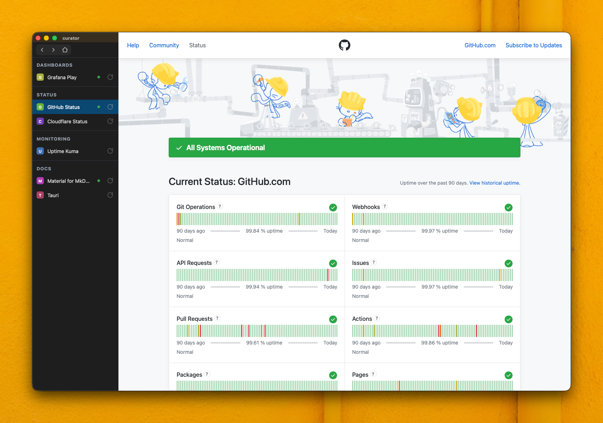

<p align="center">
  
</p>

<h1 align="center">curator</h1>

<p align="center">
  <a href="https://github.com/Lockyc/curator/releases/latest"></a>
  
  
  <a href="LICENSE"></a>
</p>

A dedicated, always-findable home for the browser tabs you can't afford to lose. macOS only.

<p align="center"></p>

Not a general browser: a minimal app (Tauri v2) that renders a *curated, declarative* set
of "keeper" tabs from a `config.toml` config, and refuses to let new-tab navigation
pollute that set — handing every such intent off to your macOS default browser instead.

## Why

Important tabs (mail, calendar, dashboards) get buried in a sea of browser windows.
Firefox pinned tabs are the closest workaround, but the pinned window itself gets lost and
keeping it clean is constant manual work. curator gives keeper tabs a distinct, stable
home that lives outside the window-pile and never accumulates cruft — curation is
file-driven, everything else is ephemeral.

## Model

- **`config.toml` is the source of truth** — each `[[window]]` block opens one window,
  containing loose `[[window.tab]]` entries and/or `[[window.group]]` sections of
  `[[window.group.tab]]`s. No in-app pin/unpin; you curate by editing the file (hot-reloaded
  on save).
- **Multiple windows** — each `[[window]]` opens its own window with its own tab list. They
  open at launch unless marked `open_on_start = false`, which registers a window **dormant** —
  configured but opened on demand from the **Window** menu. ⌘⇧W (or the red button) closes a
  window and the **Window** menu reopens it — ⌘W instead unloads the active tab. Closing the
  last open window quits curator. When no window opens at launch (every window dormant), a home
  surface lists them all to open.
- **Keeper tabs are home bases** — wander within a session, then snap any tab back to its
  canonical URL with the sidebar's ⌂ home button (or by re-clicking the active tab); every
  tab also resets on restart.
- **Outside links escape** — a link to another site (a plain click, `target="_blank"`,
  `window.open`) opens in your macOS default browser, leaving the tab where it was; cmd/middle-click
  always does. Links within the tab's own site stay in the tab.
- **Sessions persist, and are shareable** — log into a site once in-app and it stays. By
  default every tab shares one login store, so signing into a provider covers its related
  services (Gmail, Calendar, …). Set a tab's (or a window's) `session = "name"` to give it a
  separate account; reuse the same name elsewhere to share that login. Logins follow the
  `session` name, so renaming a window or editing a URL never signs you out.
- **Page-first chrome** — the active page fills the content area under an overlay title bar;
  the traffic lights float over the top of the sidebar, which doubles as a window-move drag
  handle (drag the banner or an empty area to move the window; toggle with `sidebar_drag`).
- **`load_on_open` keeps a tab live** — mark a chat/service `load_on_open` and it loads at
  launch, stays live in the background, fires native banners, and rolls its unread count up
  to the dock badge. Tabs without it are lazy and stay quiet until you open them. That one
  per-tab flag is the only knob; there are no per-window modes.
- **Dock badge aggregates across windows** — the badge total sums unread across every
  window's loaded tabs.
- **Sidebar search** — the field above the tab list narrows it as you type, matching tab titles,
  folder paths and group names. **⌘⇧F** jumps into it; **↑**/**↓** pick a match, **Enter** opens
  it, **Esc** clears the search.
- **Link destinations on hover** — hovering a link shows where it goes in a small status overlay at
  the bottom of the tab, as a browser does.
- **Pop a tab out** — pop the active tab into its own banner-only window with **⌘⇧O** (or hover
  the row's letter tile and click its pop-out icon); the pop-in icon on its sidebar tile brings it
  back. Your **login survives** —
  sessions are keyed independently of the window — but the page reloads from its canonical URL, so
  in-page state (scroll position, SPA route, unsent form input) doesn't carry across. Closing the
  popped-out window returns the tab to where it came from, reopening its origin window first if you
  closed it. A popped-out window remembers the size and position you last gave it, so a tab you pop
  out often reopens where you left it.
- **Keyboard tab navigation** (the **Tab** menu) — **⌘⇧[** / **⌘⇧]** cycle the previous/next
  *loaded* tab (cold tabs are skipped, so cycling never loads one) and **⌘1–⌘9** jump to a
  position; set `tab_digit_keys = "cycle"` to make **⌘1** / **⌘2** cycle instead (jumps shift to
  **⌘3–⌘9**).

## Install

**Download (no build):** grab `curator-<version>-macos.zip` from the
[latest release](https://github.com/Lockyc/curator/releases/latest), unzip, and move
`curator.app` to `/Applications`. macOS only.

In **Claude Code**, run `/curator:install` — it checks prerequisites (offering to install
any that are missing), builds curator from source into `~/.curator`, installs `curator.app`
to `/Applications`, and seeds your config.

Or install from a terminal:

```sh
curl -fsSL https://raw.githubusercontent.com/Lockyc/curator/main/install.sh | bash
```

Re-running either path updates curator (`git pull` + rebuild).

## Updates

curator updates itself — no reinstall. On launch, every 6 hours while open, and via
**curator ▸ Check for Updates…**, it checks GitHub for a newer release; when one exists the sidebar
shows an *Update available: v X* bar with a one-click **Update & Relaunch**.

- **Confirm-to-install** — nothing installs silently; you approve each update, and the bar's
  **×** dismisses it for the session.
- **Signed** — each update is verified against curator's own minisign key before it installs,
  independent of Apple notarization.
- **Opt out** with `auto_update = false` (the **Check for Updates…** menu item still works).

Re-running `install.sh` is only needed to bootstrap the first updater-capable version, or to
build from source.

## Setup

1. Get a config in place. Launch curator with no config and it opens its **home** screen, which
   names the path it expects and offers a **Create a starter config** button — click it and
   curator writes a minimal starter to `~/.config/curator/config.toml` for you. (It never
   overwrites: if a config is already there, it says so and leaves it untouched.)

   Prefer to start from the fuller two-window example instead, or want it in place before first
   launch:

   ```sh
   mkdir -p ~/.config/curator
   cp examples/config.toml ~/.config/curator/config.toml
   ```

   Either way it lives under `~/.config/` so it slots into a dotfiles workflow — your curated tab
   set becomes versioned, portable config.

2. Edit `~/.config/curator/config.toml` (or the file `CURATOR_CONFIG` names) and save — the
   sidebar **hot-reloads**, no restart. A malformed file keeps the last-good config running and
   shows an error banner instead of crashing. The **Config** menu has *Edit Config* / *Reveal
   Config in Finder* so you needn't memorise the path; the **Tab** menu has *Reload Tab* (⌘R),
   *Reset All Tabs* to snap every open tab back to its canonical URL, and *Open Developer Tools*
   (⌘⌥I) for the active tab.

## Config

curator opens one window per `[[window]]` block. A window's tabs may be loose (ungrouped) or
organised into groups; loose tabs render first in a headerless section, then each group:

```toml
# App-global options
# dark_mode     = true            # force dark appearance; omit = follow system
# allow_insecure = ["192.168.1.1"] # accept self-signed TLS for these hosts
# session       = "personal"      # app-wide default login store (bottom of the session chain)
# density       = "compact"       # "comfortable" (default) or "compact" (condensed chrome)
# sidebar_drag  = false           # drag the sidebar chrome to move the window (default true)
# auto_update   = false           # check for a new release on launch + every 6h (default true; menu check stays)
# tab_digit_keys = "cycle"        # ⌘1/⌘2 become next/previous tab; jumps shift to ⌘3–⌘9 (default "jump")

[[window]]
title         = "Keepers"          # required; must be unique across windows
# width       = 1500               # optional; default 1500 × 1000
# height      = 1000
# open_on_launch = true            # true = first tab even if cold; unset = first load_on_open tab
# open_on_start  = false           # default true; false = window is dormant at launch, opened from the Window menu

  # Loose (ungrouped) tab — renders first, in a headerless section above the groups.
  [[window.tab]]
  title = "Start"
  url   = "https://duckduckgo.com/"

  [[window.group]]
  name = "Dashboards"

    [[window.group.tab]]
    title        = "Grafana"
    url          = "https://play.grafana.org/"
    load_on_open = true    # load at launch + keep live
    reload_every = 5       # auto-refresh every 5 minutes

[[window]]
title = "Comms"

  [[window.group]]
  name = "Chat"

    [[window.group.tab]]
    title       = "Mattermost"
    url         = "https://community.mattermost.com/"
    load_on_open = true     # kept live → fires banners + unread in the background
```

### Global

| Key | Default | What it does |
|---|---|---|
| `dark_mode` | `false` | Force dark appearance so sites honouring `prefers-color-scheme` render dark. |
| `allow_insecure` | `[]` | Hosts whose self-signed/invalid TLS certs are accepted. Applied at launch (restart to change). |
| `session` | none | App-wide default login store — the bottom of the session chain (`tab → window → this → built-in default`). **Cascades.** |
| `density` | `comfortable` | Chrome sizing: `comfortable` or `compact` (type + spacing scaled down for denser tab lists). Hot-reloads. |
| `sidebar_drag` | `true` | Whether the sidebar chrome is a window-move drag handle (drag the banner/empty list area). Hot-reloads. |
| `auto_update` | `true` | Check for a new release on launch and every 6 hours. `false` suppresses the automatic checks; **Check for Updates…** still works. Applies to windows opened after the change. |
| `format_on_save` | `false` | Reformat the config in curator's house style on each clean hot-reload (same as `curator fmt`). A reload that fails to parse leaves the file untouched. |
| `tab_digit_keys` | `jump` | What ⌘1/⌘2 do in the **Tab** menu: `jump` — ⌘1–⌘9 jump to a position; `cycle` — ⌘1 next, ⌘2 previous, jumps shift to ⌘3–⌘9. Hot-reloads. |

### `[[window]]`

| Key | Default | What it does |
|---|---|---|
| `title` | *required* | Window title; unique across all windows. |
| `width` / `height` | `1500` / `1000` | First-run size in logical pixels; after that curator remembers each window's size and position. |
| `open_on_start` | `true` | `false` registers the window **dormant** — opened on demand from the **Window** menu / home surface. Read at launch. |
| `open_on_launch` | unset | Unset/`false` opens the first `load_on_open` tab, else a blank screen; `true` opens the first tab even if it isn't loaded. |
| `colour` | none | `#rgb` / `#rrggbb` accent for the title bar (nav pill + window name). |
| `session` | inherited from global | Default login store for this window's tabs. **Cascades.** |

### `[[window.tab]]` / `[[window.group.tab]]`

| Key | Default | What it does |
|---|---|---|
| `title` | *required* | Display label; duplicates are allowed (a tab's identity is its URL). |
| `url` | *required* | The tab's canonical URL — where ⌂ home and a reset return it. |
| `load_on_open` | `false` | Load when the window opens and stay live in the background, so it fires banners and reports unread while inactive. |
| `reload_every` | none | Auto-refresh the canonical URL every N minutes (positive integer). |
| `unread` | `all` | Which unread signals badge the row: `all` — every signal, including a countless marker; `count` — only a real number (a delivered notification still dots the row); `off` — never. See [Unread badges](#unread-badges). |
| `session` | inherited from window | Login store. Tabs sharing a value share a login, even across windows. Blank falls through the chain. |

### `[[window.group]]`

| Key | Default | What it does |
|---|---|---|
| `name` | *required* | Section header in the sidebar; unique within its window. Holds `[[window.group.tab]]`s. |

### CLI

The app binary doubles as a config tool — `/Applications/curator.app/Contents/MacOS/curator`
(or `just validate [path]` from a checkout):

- **`curator validate [path]`** prints the resolved window/tab tree (each tab's cascaded session,
  and its `unread` mode where it isn't the default) and any non-fatal warnings (e.g. a URL
  repeated within a window), exiting non-zero on a parse/validation error.
- **`curator fmt [--check] [path]`** rewrites a config in curator's house TOML style; `--check`
  reports without writing.

A bad config never crashes the app either — it keeps the last-good config running behind an error
banner.

Tabs are lazy by default: a webview is created on first activation and kept warm for the
session. Each row shows a green dot when its tab is loaded — click it to **unload** (free
that webview's memory); the tab reloads on next click. A navigation pill at the top of the
sidebar drives the active tab: **◀ back** and **▶ forward** through in-page history, and
**⌂ home** to snap back to its canonical URL. The mouse's side buttons drive the same
back/forward, and a determinate progress bar tracks each tab's page load.

See `examples/config.toml` for a two-window starting-point example.

### Unread badges

A row badges from three sources, strongest first: a **Badging-API** count the service reports
itself (`navigator.setAppBadge`), a **count in the page title** (`(3)` or `[3]`), and — weakest
— a **delivered notification**, which dots a background tab and clears when you select it. Only
real numbers reach the dock badge; a countless dot is sidebar-only.

Some services also mark *"something, somewhere is unread"* with a countless marker that, on a
busy account, is simply always on. Discord is the clearest case: its title is `• Discord`
whenever **any** channel is unread and `(N) Discord` only when you are actually mentioned — so
the marker carries no information while the count does. Set `unread = "count"` on that tab and
only the mention count badges it:

```toml
    [[window.group.tab]]
    title        = "Discord"
    url          = "https://discord.com/channels/@me"
    load_on_open = true
    unread       = "count"   # mentions badge the row; "• unread somewhere" doesn't
```

Notifications still dot the row under `count` — a banner that actually fired is evidence of a
real event, not a marker read off a title. Use `unread = "off"` to silence a tab entirely.

## Recipes

A few setups the model makes easy. All four compose freely — one window can mix them.

### Same web app, multiple accounts side by side

Point several tabs at the *same* `url` and give each a distinct `session`. curator keeps the
logins fully isolated, so you get parallel accounts of one web app — Matrix/Element
homeservers, Slack workspaces, separate Google logins — with no incognito juggling. Mark them
`load_on_open` and every account stays live and notifies at once.

```toml
[[window]]
title = "Matrix"

  [[window.group]]
  name = "Accounts"

    [[window.group.tab]]
    title        = "Work"
    url          = "https://app.element.io/"
    session      = "element-work"
    load_on_open = true

    [[window.group.tab]]
    title        = "Personal"
    url          = "https://app.element.io/"
    session      = "element-personal"
    load_on_open = true
```

### A background notification hub

Keep alert and status pages `load_on_open` so they stay live, fire native banners on new
activity even when curator isn't focused, and roll their unread up to the dock badge. Leave
everything else lazy so only the pages you *want* live cost you a banner.

```toml
  [[window.group]]
  name = "Alerts"

    [[window.group.tab]]
    title        = "ntfy"
    url          = "https://ntfy.example.com/alerts"
    load_on_open = true

    [[window.group.tab]]
    title        = "Status"
    url          = "https://status.example.com/"
    load_on_open = true
```

### An operator console for self-hosted infra

Collect the sprawl of admin UIs — hypervisor, NAS, DNS, reverse proxy, registrar — into named
groups in one window. Give the window a `colour` so it's instantly recognisable, and let most
tabs stay lazy and quiet; only the dashboards you watch get `load_on_open`.

```toml
[[window]]
title  = "Infra"
colour = "#0f8a8a"

  [[window.group]]
  name = "Network"

    [[window.group.tab]]
    title = "UniFi"
    url   = "https://unifi.example.com/"

    [[window.group.tab]]
    title = "Proxmox"
    url   = "https://pve.example.com/"

  [[window.group]]
  name = "DNS & Domains"

    [[window.group.tab]]
    title = "Cloudflare"
    url   = "https://dash.cloudflare.com/"
```

### Homelab devices with self-signed certs

List the hosts whose invalid/self-signed TLS you trust in the app-global `allow_insecure` so
their admin pages load without the browser security wall. Scope it tightly — only the hosts
you actually run.

```toml
allow_insecure = ["10.0.0.1", "nas.local"]
```

## Build

Needs Rust and the Tauri CLI (`cargo install tauri-cli --version ^2`).

```sh
just run      # launch against examples/config.toml (never touches your real config)
just test     # Rust tests
just gate     # the full pre-merge gate (no active [patch], fmt-check, clippy, tests, example-config fmt)
just build    # build curator.app
just deploy   # build, install to /Applications, and relaunch
git config core.hooksPath .githooks   # once per clone: arms the pre-commit / pre-push hooks
```

The app icon source is `src-tauri/icons/icon.svg`; regenerate with
`cargo tauri icon src-tauri/icons/icon.svg`.

## Related projects

curator is built on three shared library crates. Building it from source pulls them in
automatically — they're pinned Git dependencies, resolved by a plain `cargo build` / `just run`
with nothing extra to install:

- **[chrome-core](https://github.com/Lockyc/chrome-core)** — the sidebar chrome (banner,
  grouped tab rows, resize drag, density tokens). A build-dependency: its CSS/JS is
  materialized into curator's bundled web assets at compile time.
- **[config-core](https://github.com/Lockyc/config-core)** — the TOML config engine (parse,
  validate, format, hot-reload diff) behind curator's config and `curator fmt`.
- **[shell-core](https://github.com/Lockyc/shell-core)** — the shared release tooling + Tauri
  runtime setup. `build.rs` materializes the release scripts (git-ignored) and stamps the
  build; the app registers geometry/updater/process via its `register_plugins`, and draws its
  mouse side-button navigation (an NSEvent monitor) and content-load progress bar from shell-core too.

Those same cores are also shared with two **sibling apps, [warden](https://github.com/Lockyc/warden)**
(curates **terminals**) and **[lector](https://github.com/Lockyc/lector)** (curates **local
documentation sites**), the way curator curates **browser tabs**. Neither is a dependency of
curator — they're peer projects that just draw from the same cores.

If you want to iterate on a shared core, `just chrome-dev` builds curator against a sibling
`../chrome-core` checkout (including uncommitted edits) and `just chrome-pin` re-pins to its
pushed commit afterward; `just config-dev` / `just config-pin` and `just shell-dev` / `just shell-pin`
are the same pair for `../config-core` and `../shell-core`.

## License

[MIT](LICENSE)
